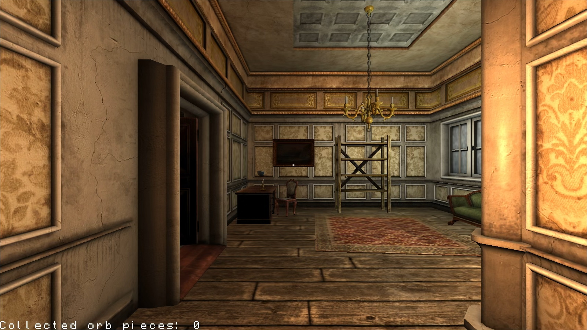
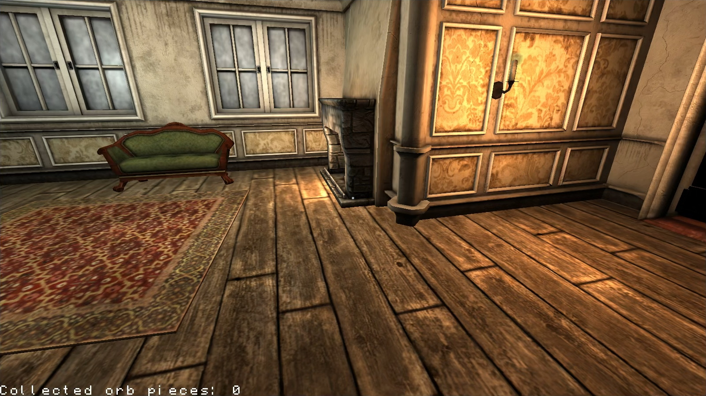
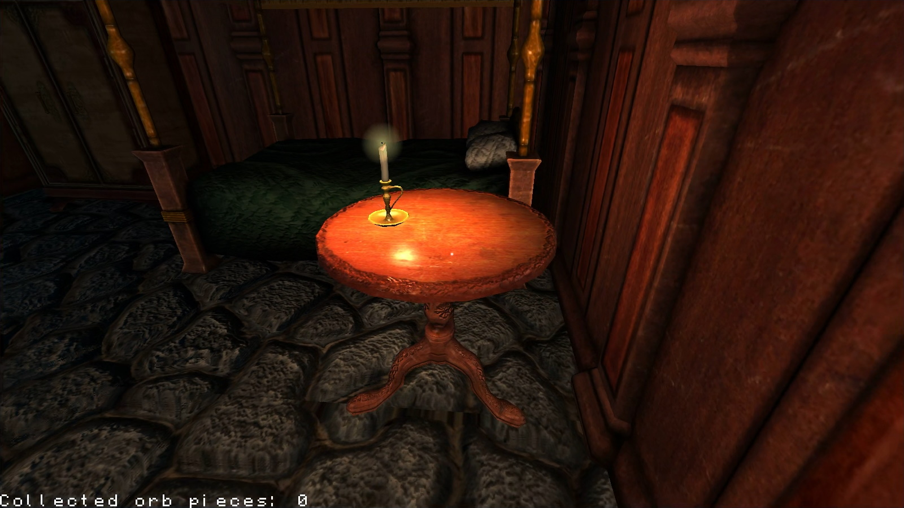
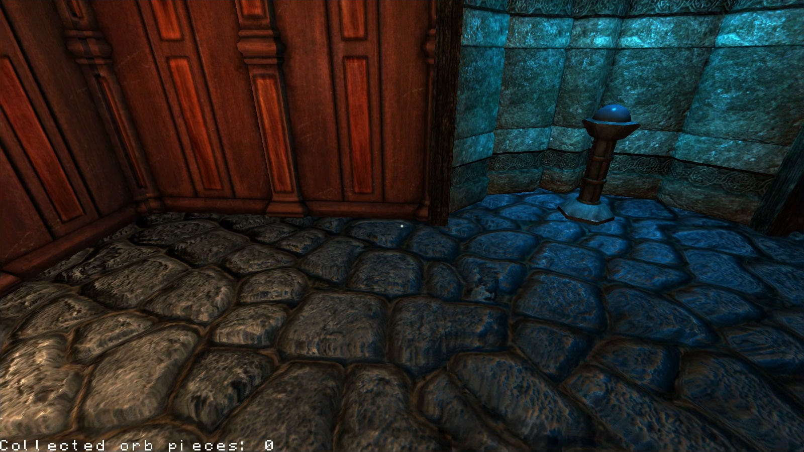

# CPP-3D-Engine
This is an OpenGL-based 3D game engine written in C++, done in 2020 as a final project for one of my university subjects.

The initial boilerplate rendering code was provided by the teacher, but the rest was done by me.

The demo scene I ended up creating is made out of "Amnesia - The Dark Descent" game assets.

### Preview images:

